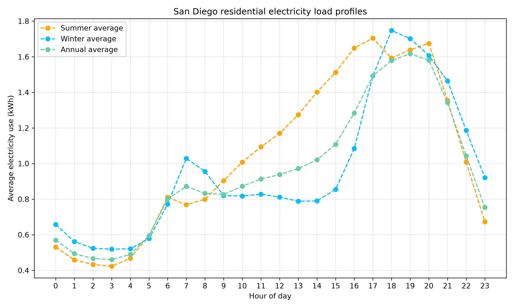
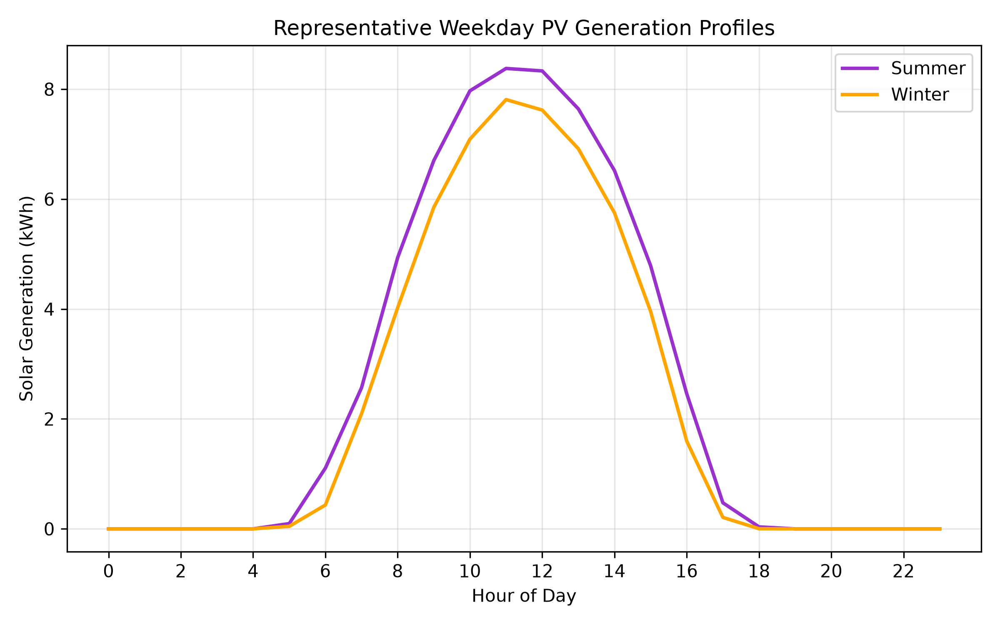
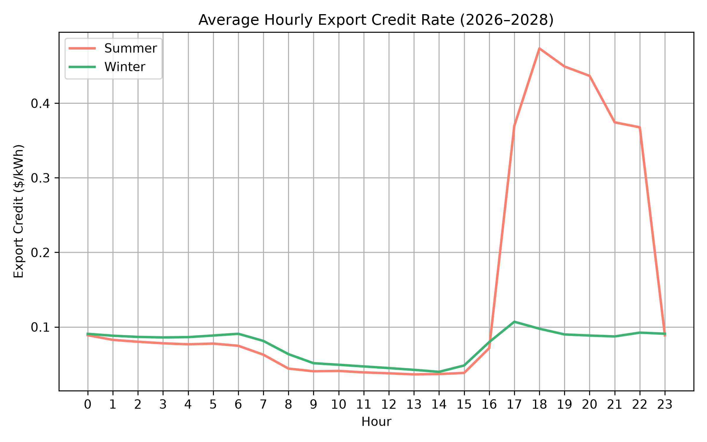
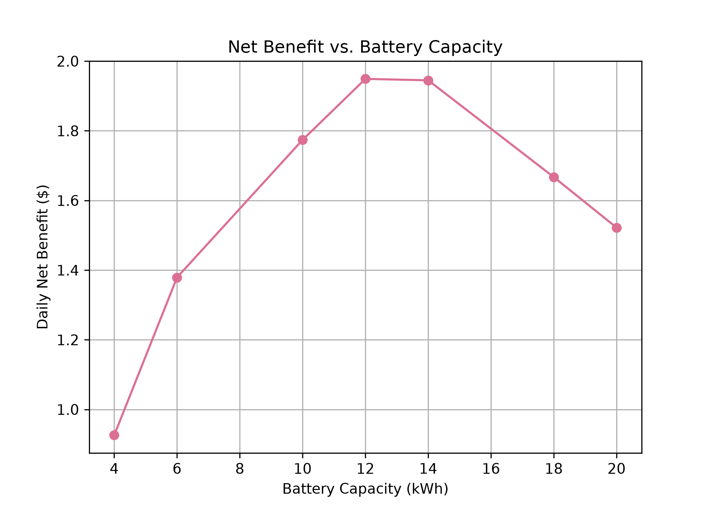
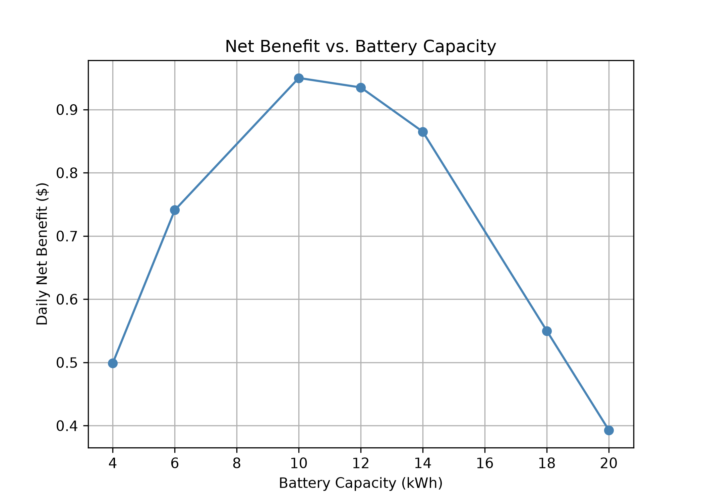

# Seasonal Representative-Day Screening of Battery Capacity for an Existing Residential PV System

**Xinyu Luo**  
Institute for Computing in Research

**Sung Bum Ahn**  
Electric Reliability Council of Texas, Taylor, TX, USA

> **Revision status:** This Markdown manuscript corresponds to `main_revised_ieee.tex`. The numerical results reproduce the current repository outputs and remain provisional until the seasonal and weekday filters are harmonized and the optimization is rerun. See `REVISION_NOTES.md`.

## Abstract

This study screens candidate battery capacities for an existing residential photovoltaic (PV) system in San Diego, California, using representative summer and winter daily profiles. For each candidate capacity, a linear program minimizes the cost of grid imports net of export credits subject to hourly energy-balance, battery-power, state-of-charge, efficiency, PV-only charging, and daily cyclic-state constraints. Candidate capacities are then compared after applying an annualized battery-capital charge. In the current repository outputs, the highest representative-day net benefit occurs at 12 kWh in summer and 10 kWh in winter, with daily net benefits of $1.949 and $0.950, respectively. These values are screening results rather than annual investment optima: the present implementation uses one representative day per season, evaluates only seven discrete capacities, excludes degradation and several ownership costs, and contains preprocessing inconsistencies that require correction and recomputation before publication. The study therefore illustrates how seasonal PV production, time-of-use import prices, and export credits can affect storage value, while motivating a full-year, uncertainty-aware sizing analysis.

**Keywords:** battery energy storage; distributed energy resources; economic dispatch; net billing; photovoltaic systems; residential energy management; time-of-use pricing

## 1. Introduction

Residential photovoltaic (PV) generation can reduce grid purchases, but its midday production frequently does not coincide with residential evening demand. A battery energy storage system can shift PV energy to higher-value hours, increase self-consumption, and provide other services not evaluated here. The economic value of storage nevertheless depends on the household load, PV production, retail tariff, export compensation, equipment cost, and operating constraints.

Prior work has evaluated residential PV–battery economics, adoption, and resilience across several geographic and regulatory settings [1]–[5]. Related work on utility-scale co-location shows that shared infrastructure can create value while geographic and operational restrictions can impose penalties [6]. These findings indicate that storage value is context-dependent and should be evaluated using tariff- and location-specific data.

This paper presents a San Diego case study using residential load data, PVWatts generation, San Diego Gas & Electric (SDG&E) time-of-use (TOU) import prices, and Net Billing Tariff export credits. The analysis is incremental: it evaluates battery capacity for a household that already has the modeled PV system. It does not evaluate the total profitability of purchasing both PV and storage because PV capital cost and fixed installation cost are outside the model.

The intended contributions are:

1. Formulate a transparent representative-day dispatch model for PV-only battery charging under hourly import and export prices.
2. Compare operating savings with an annualized capacity-dependent battery cost.
3. Identify the assumptions and data-alignment issues that must be addressed when moving from seasonal screening to an annual investment decision.

## 2. Data and Preprocessing

### 2.1 Residential Load

The residential load data represent a detached single-family home built to the 2009 International Energy Conservation Code and simulated with EnergyPlus using Typical Meteorological Year 3 weather for San Diego Miramar. Hourly values from the *Electricity:Facility* output are treated as energy consumed during each one-hour interval.

The preprocessing script applies a fast Fourier transform to the annual series for comparison, but the optimization inputs use arithmetic hourly means rather than the Fourier-smoothed series. The saved summer and winter load profiles currently average all days in June–August and December–February, respectively. Consequently, the load profiles themselves are not weekday-only profiles.

### 2.2 PV Generation

Hourly AC PV generation was obtained from the National Renewable Energy Laboratory PVWatts Version 8 model. The archived API response records a 12 kWdc system, a tilt of $30^\circ$, an azimuth of $180^\circ$, a DC-to-AC ratio of 1.2, 14% system losses, and 96% inverter efficiency. The current preprocessing script maps the 8760 values to a 2025 calendar and averages nominal weekdays by hour.

The saved PV profiles currently define summer as June–October and winter as November–May. These month sets differ from those used for the load and export-credit profiles. This mismatch is disclosed because the current figures and numerical results were generated from those saved files; the profiles must be regenerated with consistent definitions before submission.

### 2.3 Import Prices and Export Credits

The dispatch model applies the SDG&E weekday TOU schedule shown below. The summer peak import price is applied from 16:00 through 20:59. The winter schedule uses the corresponding winter price periods.

| Period | Rate ($/kWh) |
|---:|---:|
| 1 | 0.71598 |
| 2 | 0.38853 |
| 3 | 0.34545 |
| 4 | 0.50219 |
| 5 | 0.37682 |
| 6 | 0.33764 |

Export compensation is calculated as the sum of generation and delivery components in the 2026 current-year NBT pricing file. The saved hourly export profiles average values from 2026–2028. They currently use June–August for summer and December–February for winter and do not filter out weekends. The maximum saved summer export credit is approximately $0.474/kWh at 18:00, below the modeled summer peak import rate of $0.716/kWh.

## 3. Optimization Model

### 3.1 Decision Variables and Operating Cost

Let $\mathcal{T}=\{0,\ldots,23\}$ index the hourly intervals of a representative day, and let $B$ denote a candidate battery energy capacity. For each $t\in\mathcal{T}$, the nonnegative decision variables are battery charge $c_t$, battery discharge $d_t$, grid import $g_t^{\mathrm{imp}}$, and grid export $g_t^{\mathrm{exp}}$. The state of charge $s_t$ is defined for $t\in\{0,\ldots,24\}$.

For a fixed $B$, the dispatch problem minimizes net grid-energy cost:

$$
J(B)=\min \sum_{t\in\mathcal{T}}
\left(
\pi_t^{\mathrm{imp}}g_t^{\mathrm{imp}}
-
\pi_t^{\mathrm{exp}}g_t^{\mathrm{exp}}
\right),
$$

where $\pi_t^{\mathrm{imp}}$ and $\pi_t^{\mathrm{exp}}$ are the hourly import and export prices, respectively. Battery capital cost is not included in the dispatch objective; it is included later when candidate sizes are ranked.

### 3.2 Operating Constraints

The hourly energy balance is

$$
p_t^{\mathrm{PV}}+g_t^{\mathrm{imp}}+d_t
=
\ell_t+c_t+g_t^{\mathrm{exp}},
\qquad t\in\mathcal{T},
$$

where $p_t^{\mathrm{PV}}$ is PV energy and $\ell_t$ is household load.

Battery state evolves according to

$$
s_{t+1}=s_t+\eta_c c_t-\frac{d_t}{\eta_d},
\qquad t\in\mathcal{T},
$$

with charging and discharging efficiencies $\eta_c=\eta_d=0.95$. The state and power limits are

$$
0\le s_t\le B, \qquad t=0,\ldots,24,
$$

$$
0\le c_t\le \frac{B}{2}, \qquad t\in\mathcal{T},
$$

$$
0\le d_t\le \frac{B}{2}, \qquad t\in\mathcal{T}.
$$

Because each interval is one hour, the $B/2$ energy-per-interval bounds correspond numerically to a 0.5C charge and discharge power rating.

A cyclic boundary condition prevents the representative-day optimization from using initial stored energy without replenishment:

$$
s_0=s_{24}=\frac{B}{2}.
$$

The implementation restricts charging and export through

$$
c_t+g_t^{\mathrm{exp}}\le p_t^{\mathrm{PV}},
\qquad t\in\mathcal{T},
$$

which represents PV-only battery charging and assigns grid exports to contemporaneous PV production. The current linear program does not explicitly impose mutually exclusive charge/discharge or import/export operating modes.

### 3.3 Capital-Cost Ranking

The current code assumes a battery cost of $800/kWh, a capacity-based incentive of $200/kWh, zero fixed installation cost, a 7% discount rate, and a 10-year life. Thus, the modeled net upfront cost is

$$
C_{\mathrm{net}}(B)=B(800-200).
$$

No separate federal investment tax credit is applied in the implementation.

The capital recovery factor is

$$
\mathrm{CRF}=\frac{r(1+r)^n}{(1+r)^n-1},
$$

and the annualized capital cost is

$$
C_{\mathrm{ann}}(B)=C_{\mathrm{net}}(B)\,\mathrm{CRF}.
$$

For each representative season, daily net benefit relative to PV without a battery is

$$
\mathrm{NB}(B)=J(0)-J(B)-\frac{C_{\mathrm{ann}}(B)}{365}.
$$

Candidate capacities are selected by maximizing the above expression over

$$
\mathcal{B}=\{4,6,10,12,14,18,20\}\ \mathrm{kWh}.
$$

This is a discrete screening exercise, not continuous capacity optimization.

## 4. Results

The following table reproduces the current repository outputs. Among the seven candidates, 12 kWh has the highest summer representative-day net benefit, while 10 kWh has the highest winter representative-day net benefit. The negative summer operating cost for the 12 kWh case means that modeled export credits exceed modeled import charges for that representative day; it does not mean total household electricity service is cost-free because fixed charges and other bill components are excluded.

| Metric | Summer | Winter |
|---|---:|---:|
| Selected candidate (kWh) | 12 | 10 |
| Operating cost ($/day) | -0.237 | 0.354 |
| Operating savings ($/day) | 4.758 | 3.291 |
| Annualized capital cost ($/yr) | 1025.118 | 854.265 |
| Daily capital charge ($/day) | 2.809 | 2.340 |
| Net benefit ($/day) | 1.949 | 0.950 |

The summer curve is relatively flat near its maximum: the saved result is $1.949/day at 12 kWh and $1.945/day at 14 kWh, a difference of only $0.004/day. This difference is too small to support a robust preference without sensitivity and uncertainty analysis.

In winter, the saved net benefit peaks at $0.950/day for 10 kWh and declines to $0.935/day for 12 kWh. Larger batteries continue to increase operating savings, but the modeled incremental savings are smaller than the added daily capital charge.

## 5. Discussion

The current outputs illustrate two mechanisms. First, greater modeled summer PV production creates more energy that can be shifted or exported. Second, the summer TOU price spread is larger than the winter spread, increasing the avoided cost of evening grid purchases. The result is a higher representative-day storage value in summer.

The model does not establish that a household should purchase one battery for summer and another for winter. A residential battery is a single long-lived investment whose capacity should be selected using an annual chronology or a properly weighted set of representative days. Multiplying either seasonal result by 365 would repeat one seasonal day for an entire year and therefore would not produce a defensible annual benefit estimate.

The phrase “economic feasibility of PV–battery co-location” must also be interpreted narrowly here. The baseline already includes PV, and the model excludes PV capital cost, fixed battery installation cost, operation and maintenance, degradation, replacement, taxes, fixed utility charges, demand charges, inverter limits, outage value, and residual value. The outputs measure incremental modeled value of battery capacity under the stated assumptions, not the total return on a new combined PV–battery purchase.

## 6. Limitations and Required Validation

The following issues must be resolved before the numerical findings can support a journal submission:

1. Harmonize the summer/winter month definitions across load, PV, export-credit, and tariff preprocessing, then regenerate every profile, table, figure, and result.
2. Apply a consistent weekday policy. The current load averages all days, PV averages nominal weekdays, export credits average all dates, and import prices use a weekday schedule.
3. Replace seasonal representative-day sizing with an 8760-hour chronological analysis, or use weighted representative days with explicit transition and annual-energy treatment.
4. Evaluate a finer or continuous capacity range and report sensitivity to battery cost, incentive eligibility, discount rate, lifetime, efficiency, C-rate, degradation, PV size, load level, tariffs, and export credits.
5. Validate solver status and dispatch feasibility and test whether explicit non-simultaneity constraints change the solution.
6. Add primary citations for the load dataset, PVWatts inputs, SDG&E tariff, NBT export-credit file, incentive, and cost assumptions.

## 7. Conclusion

A linear representative-day dispatch model was used to screen seven battery capacities for an existing 12 kW residential PV system in San Diego. In the current repository outputs, 12 kWh and 10 kWh provide the highest summer and winter representative-day net benefits, respectively. The near-tie between 12 and 14 kWh in summer, together with inconsistent preprocessing periods and the lack of a full-year chronology, prevents these values from being interpreted as robust investment recommendations. The appropriate next step is a harmonized 8760-hour analysis that selects one battery capacity using annual net benefit and quantifies sensitivity and uncertainty.

## References

1. V. Bagalini, B. Y. Zhao, R. Z. Wang, and U. Desideri, “Solar PV-battery-electric grid-based energy system for residential applications: System configuration and viability,” *Research*, vol. 2019, Art. no. 3838603, 2019. https://doi.org/10.34133/2019/3838603
2. E. Tervo, K. Agbim, F. DeAngelis, J. Hernandez, H. K. Kim, and A. Odukomaiya, “An economic analysis of residential photovoltaic systems with lithium ion battery storage in the United States,” *Renewable and Sustainable Energy Reviews*, vol. 94, pp. 1057–1066, 2018. https://doi.org/10.1016/j.rser.2018.06.055
3. B. Bollinger, N. R. Darghouth, G. Barbose, S. Forrester, and E. O’Shaughnessy, “Valuing technology complementarities: Rooftop solar and energy storage,” National Bureau of Economic Research, Working Paper 32003, 2023. https://doi.org/10.3386/w32003
4. T. Sun, Y. Feng, C. Zanocco, J. Flora, A. Majumdar, and R. Rajagopal, “Solar and battery can reduce energy costs and provide affordable outage backup for US households,” *Nature Energy*, vol. 10, pp. 1025–1040, 2025.
5. S. Baik, C. Miller, and J. P. Carvallo, “The resilience value of residential solar + storage systems in the continental U.S.,” *Environmental Research: Energy*, vol. 1, no. 4, Art. no. 045012, 2024. https://doi.org/10.1088/2753-3751/ad93da
6. W. Gorman, C. Crespo Montañés, A. D. Mills, J. H. Kim, D. Millstein, and R. H. Wiser, “Are coupled renewable-battery power plants more valuable than independently sited installations?” *Energy Economics*, vol. 107, Art. no. 105832, 2022. https://doi.org/10.1016/j.eneco.2022.105832
